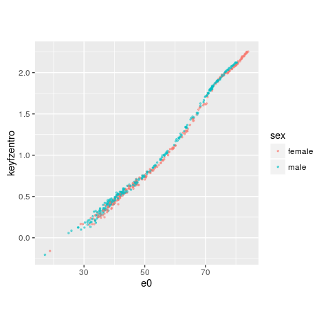
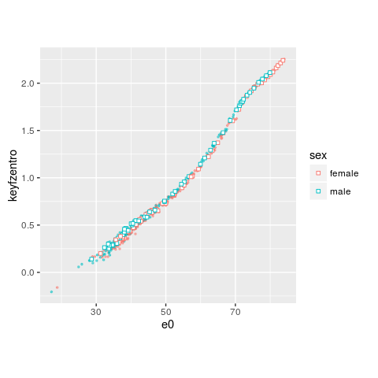

lifequal: Calculating Life-table Lifespan Equality
================
Jonas Schöley
2016-02-26

How to install
--------------

You can install `lifequal` by running:

``` r
install.packages("devtools")
devtools::install_github("jschoeley/lifequal")
```

What does it do?
----------------

`lifequal` lets you calculate three measures of lifespan equality from a life-table:

1.  `ExDagger(x, ex, wx, ax)` Life expectancy lost by those who die in age interval \[x, x+w)
2.  `EDagger(dx, exdagger, radix)` Total life expectancy lost due to death
3.  `KeyfzEntro(edagger, e0)` Keyfitz's entropy

They are defined as follows,

<table>
<colgroup>
<col width="53%" />
<col width="46%" />
</colgroup>
<thead>
<tr class="header">
<th align="left">Measure</th>
<th align="left">Definition</th>
</tr>
</thead>
<tbody>
<tr class="odd">
<td align="left">Start of age interval</td>
<td align="left"><span class="math inline"><em>x</em></span></td>
</tr>
<tr class="even">
<td align="left">Width of age interval starting at <span class="math inline"><em>x</em></span></td>
<td align="left"><span class="math inline"><em>w</em><sub><em>x</em></sub></span></td>
</tr>
<tr class="odd">
<td align="left">Start of last age interval</td>
<td align="left"><span class="math inline"><em>ω</em></span></td>
</tr>
<tr class="even">
<td align="left">Average time spent in age interval <span class="math inline">[<em>x</em>, <em>x</em> + <em>w</em><em>x</em>)</span> when dying in that interval</td>
<td align="left"><span class="math inline"><em>a</em><sub><em>x</em></sub></span></td>
</tr>
<tr class="odd">
<td align="left">Deaths in age interval <span class="math inline">[<em>x</em>, <em>x</em> + <em>w</em><sub><em>x</em></sub>)</span></td>
<td align="left"><span class="math inline"><em>d</em><sub><em>x</em></sub></span></td>
</tr>
<tr class="even">
<td align="left">Life-expectancy at age <span class="math inline"><em>x</em></span></td>
<td align="left"><span class="math inline"><em>e</em><sub><em>x</em></sub></span></td>
</tr>
<tr class="odd">
<td align="left">Life expectancy lost due to death in age interval <span class="math inline">[<em>x</em>, <em>x</em> + <em>w</em><sub><em>x</em></sub>)</span></td>
<td align="left"><span class="math inline">$e_x^\dagger = \frac {a_x} {w_x}e_{x+w_x} + (1-\frac {a_x} {w_x}) e_x$</span></td>
</tr>
<tr class="even">
<td align="left">Total life expectancy lost due to death</td>
<td align="left"><span class="math inline">$e^\dagger = \sum_{x=0}^{\omega} d_x e_x^\dagger$</span></td>
</tr>
<tr class="odd">
<td align="left">Keyfitz's Entropy</td>
<td align="left"><span class="math inline">$\frac{e^\dagger} {e_0}$</span></td>
</tr>
</tbody>
</table>

Life expectancy versus lifespan equality for 1x1 Swedish life-tables
--------------------------------------------------------------------

``` r
library(lifequal)
library(dplyr)
library(ggplot2)
```

The analysis starts with a demographic life-table. We want 1) age groups ordered from low to high, 2) no gaps between subsequent age groups. Something like this:

``` r
# Swedish 1x1 period life-tables by period and sex
sweden1x1
```

    ## Source: local data frame [58,608 x 11]
    ## 
    ##       sex period     x      mx      qx    ax     lx    dx    Lx      Tx
    ##     (chr)  (int) (int)   (dbl)   (dbl) (dbl)  (int) (int) (int)   (int)
    ## 1  female   1751     0 0.21223 0.18651  0.35 100000 18651 87877 3987544
    ## 2  female   1751     1 0.04941 0.04822  0.50  81349  3923 79388 3899667
    ## 3  female   1751     2 0.03225 0.03174  0.50  77427  2457 76198 3820279
    ## 4  female   1751     3 0.02601 0.02567  0.50  74970  1925 74007 3744080
    ## 5  female   1751     4 0.02370 0.02342  0.50  73045  1711 72190 3670073
    ## 6  female   1751     5 0.01876 0.01859  0.50  71334  1326 70671 3597884
    ## 7  female   1751     6 0.01296 0.01287  0.50  70008   901 69558 3527212
    ## 8  female   1751     7 0.00877 0.00873  0.50  69107   603 68806 3457654
    ## 9  female   1751     8 0.00608 0.00606  0.50  68504   415 68296 3388849
    ## 10 female   1751     9 0.00494 0.00493  0.50  68089   335 67921 3320553
    ## ..    ...    ...   ...     ...     ...   ...    ...   ...   ...     ...
    ## Variables not shown: ex (dbl)

First, we use `ExDagger()` on each single life-table (separate by period and sex) to calculate the life expectancy lost in each age. We then summarise each life-table into a set of 3 numbers: Life expectancy at birth, total life years lost due to death (`EDagger()`) and lifespan equality (`KeyfzEntro()`). Note that we transform Keyfitz's Entropy by taking the negative log.

``` r
sweden1x1 %>%
  # ...for each single life-table...
  group_by(period, sex) %>%
  #...we calculate the life years lost in age x...
  mutate(exdagger = ExDagger(x, ex)) %>%
  # ...and then summarise each life-table into a set of 3 numbers:
  # e0:         Life-expectancy at birth
  # edagger:    Total life years lost due to death
  # keyfzentro: Lifespan equality
  summarise(
    e0         = ex[x == 0],
    edagger    = EDagger(dx, exdagger, radix = 100000),
    keyfzentro = -log(KeyfzEntro(edagger, e0))
  ) -> sweden1x1summary
```

The summarised life-tables look like this:

``` r
sweden1x1summary
```

    ## Source: local data frame [528 x 5]
    ## Groups: period [?]
    ## 
    ##    period    sex    e0  edagger keyfzentro
    ##     (int)  (chr) (dbl)    (dbl)      (dbl)
    ## 1    1751 female 39.88 26.42272  0.4116507
    ## 2    1751   male 36.81 26.29076  0.3365518
    ## 3    1752 female 36.75 28.65525  0.2488017
    ## 4    1752   male 33.88 28.26324  0.1812630
    ## 5    1753 female 41.27 27.49097  0.4062782
    ## 6    1753   male 38.05 27.36753  0.3295438
    ## 7    1754 female 39.01 27.45547  0.3512526
    ## 8    1754   male 35.80 27.05649  0.2800211
    ## 9    1755 female 37.60 27.59827  0.3092511
    ## 10   1755   male 35.34 27.21785  0.2611423
    ## ..    ...    ...   ...      ...        ...

For each life-table we plot the life expectancy at birth versus the lifespan equality.

``` r
plot_lifequal <-
  ggplot(sweden1x1summary, aes(x = e0, y = keyfzentro, color = sex)) +
  geom_point(size = 0.6, alpha = 0.5) +
  theme(aspect.ratio = 1)
plot_lifequal
```



Life expectancy versus lifespan equality for 5x5 Swedish life-tables
--------------------------------------------------------------------

The same exercise as before, only now we deal with life-tables aggregated over multiple year period and age intervals.

``` r
# Swedish 5x5 period life-tables by period and sex
sweden5x5
```

    ## Source: local data frame [2,496 x 12]
    ## 
    ##       sex    period     x    wx      mx      qx    ax     lx    dx     Lx
    ##     (chr)     (chr) (int) (dbl)   (dbl)   (dbl) (dbl)  (int) (int)  (int)
    ## 1  female 1755-1759     0     1 0.23517 0.20399  0.35 100000 20399  86741
    ## 2  female 1755-1759     1     4 0.04076 0.14805  1.52  79601 11785 289151
    ## 3  female 1755-1759     5     5 0.01256 0.06043  1.88  67816  4098 326313
    ## 4  female 1755-1759    10     5 0.00658 0.03239  2.53  63718  2064 313492
    ## 5  female 1755-1759    15     5 0.00622 0.03063  2.44  61654  1888 303428
    ## 6  female 1755-1759    20     5 0.00720 0.03537  2.62  59766  2114 293794
    ## 7  female 1755-1759    25     5 0.00929 0.04544  2.57  57652  2620 281902
    ## 8  female 1755-1759    30     5 0.01230 0.05971  2.53  55032  3286 267060
    ## 9  female 1755-1759    35     5 0.01108 0.05389  2.49  51746  2788 251744
    ## 10 female 1755-1759    40     5 0.01622 0.07806  2.59  48958  3822 235561
    ## ..    ...       ...   ...   ...     ...     ...   ...    ...   ...    ...
    ## Variables not shown: Tx (int), ex (dbl)

We deal with this aggregation by informing `ExDagger()` about \(w_x\), the width of each age interval. This information is included in the column `wx` of our life-table.

``` r
sweden5x5 %>%
  # for practicality we assume a width of 2
  # years for the last open age group 110+
  mutate(wx = ifelse(is.na(wx), 2, wx)) %>%
  # ...for each single life-table...
  group_by(period, sex) %>%
  #...we calculate the life years lost in age interval [x, x+wx)...
  mutate(exdagger = ExDagger(x, ex, wx, ax)) %>%
  # ...and then summarise each life-table into a set of 3 numbers:
  # e0:         Life-expectancy at birth
  # edagger:    Total life years lost due to death
  # keyfzentro: Lifespan equality
  summarise(
    e0         = ex[x == 0],
    edagger    = EDagger(dx, exdagger, radix = 100000),
    keyfzentro = -log(KeyfzEntro(edagger, e0))
  ) -> sweden5x5summary
```

The summarised life-tables look like this:

``` r
sweden5x5summary
```

    ## Source: local data frame [104 x 5]
    ## Groups: period [?]
    ## 
    ##       period    sex    e0  edagger keyfzentro
    ##        (chr)  (chr) (dbl)    (dbl)      (dbl)
    ## 1  1755-1759 female 36.80 26.33548  0.3345809
    ## 2  1755-1759   male 33.89 26.03847  0.2635449
    ## 3  1760-1764 female 36.50 26.60345  0.3162712
    ## 4  1760-1764   male 33.62 26.12272  0.2523156
    ## 5  1765-1769 female 37.81 26.52746  0.3543933
    ## 6  1765-1769   male 34.78 26.16651  0.2845622
    ## 7  1770-1774 female 31.23 25.58650  0.1993144
    ## 8  1770-1774   male 28.67 24.93197  0.1397002
    ## 9  1775-1779 female 38.08 26.55897  0.3603218
    ## 10 1775-1779   male 35.95 26.48334  0.3056131
    ## ..       ...    ...   ...      ...        ...

The aggregated life-tables follow the same trend as the single year life-tables.

``` r
plot_lifequal +
  geom_point(shape = 22, fill = "white",
             data = sweden5x5summary)
```


